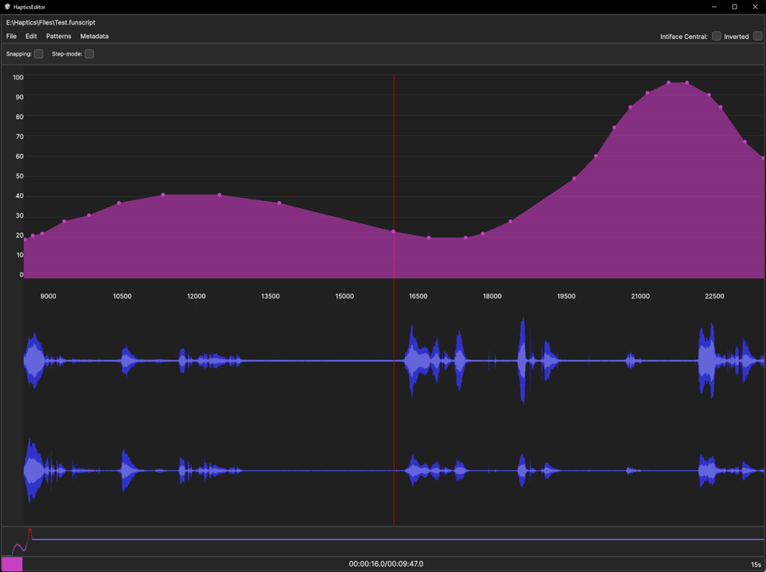

# Haptics Editor

This project is a tool for creating funscripts. For those unaware, funscript is a JSON file that contains a list of actions, that can be sent to a supported bluetooth toy to control it in sync with audio or video files. This tool uses [Intiface Central](https://buttplug.io/)'s unity package to connect to Intiface Central, in order to sync the haptics to toys.

Supports only .mp3 audiofiles, for any other formats you should first export it as .mp3 using Audacity.

Special thanks to u/yaliplover for pre-alpha-testing and supporting this tool since its infancy!

> If you like using this Haptics Editor, and want to donate towards its development, or just in general make my day... You can sponsor me here on [github](https://github.com/sponsors/ilor1) or buy me a [ko-fi](https://ko-fi.com/ilori). Not expected, but immensely appreciated!

## Installation

#### Windows:
1. Download and run the latest version from the [Releases page](https://github.com/ilor1/HapticsEditor-v2/releases/)

alternatively:
1. Clone the repository
2. Open in Unity
3. Build the project

#### MacOS:
1. Clone the repository
2. Open in Unity
3. Build the project

## Getting started
1. Run the HapticsEditor.exe
2. Go to `File > Load Audio` and select an .mp3 file
3. a .funscript file with a matching name gets created/loaded automatically

#### Bindings
* 'Ctrl-S' - saves the funscript (one file per layer)
* 'Shift-Ctrl-S' - saves the funscript (merges all layers to single file)
* 'Space' - toggles playback 
* 'D' - skips forward 8 seconds
* 'A' - skips backward 8 seconds
* 'S' - decreases playback speed
* 'W' - increases playback speed
* 'Page Up' - zooms in
* 'Page Down' - zooms out
* 'R' - Resets zoom-level
* 'RMB' - removes next point
* 'Left-Alt + RMB' - removes previous point
* 'Q' - toggles Step-Mode in Default Scripting Mode
* 'Q' - cycles patterns in Pattern Scripting Mode
* 'F1' - cycles scripting modes
* '1' - changes to Default scripting mode
* '2' - changes to Pattern scripting mode
* '3' - changes to Free scripting mode
* 'F2' - toggles Snapping
* 'F5' - cycles available stylesheets

#### Cursor Data
* 'pos' - Current Pos value
* 'at' - Current At value
* 'prev' - Delta to previous point

#### Navigation
* To navigate the timeline you can:
  * Playback with different speeds
  * Skip back/forward using the above binds.
  * Click and Drag the timebar at the bottom to 
  * Click and Drag the waveform for finer adjustments

## Scripting features
* [Default-Mode](./_Documentation/default-mode.md)
* [Pattern-Mode](./_Documentation/pattern-mode.md)
* [Freeform-Mode](./_Documentation/freeform-mode.md)
* [Cut/Copy-And-Paste](./_Documentation/cutcopypaste.md)
* [Layers](./_Documentation/layers.md)

## Misc features
* On-Load: Automatic funscript loading/creation
* On-Load: Automatic metadata generation (typical fields, duration, range, etc)
* On-Adding-A-Point: Automatic-cleanup of excess points using [Ramer-Douglas-Peucker algorithm](https://en.wikipedia.org/wiki/Ramer%E2%80%93Douglas%E2%80%93Peucker_algorithm)
* On-Save: Automatic adding of points every 30 seconds, and on the start and end
* `Metadata`-Window for editing the metadata
* `Patterns`-Window for creating new patterns
* `Edit > Bindings`-Window for editing bindings
* `Edit > Settings`-Window for editing various settings