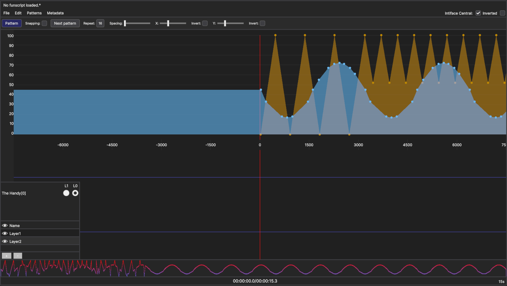

# Layers

documentation in work...

#### Adding Layers

* Loading a funscript automatically creates a new layer 
* Press the '+' button to create new layers at anytime
* Each layer gets a random color upon creation (for now)

#### Selecting Layers

* Highlighted (lighter color) layers are selected
* All actions affect all selected layers 
  * This includes adding a point, removing a point, adding a pattern, freeform, etc
* Click on a layer to select/deselect it

#### Hiding Layers

* Pressing the 'eye' button toggles layer visibility
* Hidden layers are automatically deselected to prevent unwanted edits

#### Removing Layers

* Press the '-' button to remove all **selected** layers

#### Toys
* Connected toys get automatically listed
* Each toy will have a radio button for each layer, this selects which layer the toy plays
  * invisible layers are ignored in playback

#### Saving

* Pressing 'Ctrl+S' saves each layer as a separate funscript file
* Pressing 'Shift+Ctrl+S' merges all layers into a single funscript
  * Merging uses the highest 'pos' value from all the layers