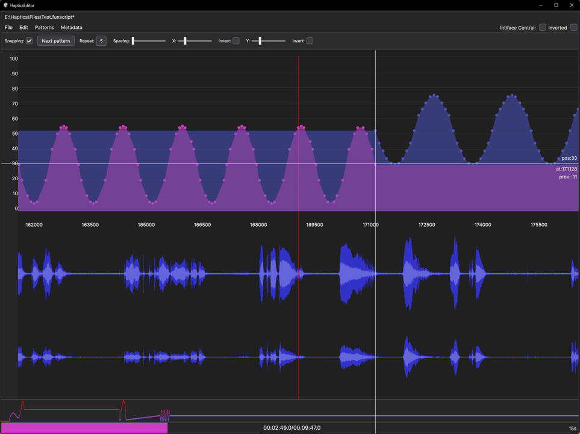

# Pattern Scripting Mode

documentation in work...

#### Snapping (F2)

#### Next Pattern (Q)

#### Repeat (Shift + Scroll-Wheel)

#### Spacing (Alt + Scroll-Wheel)

####  (Scale) X (Ctrl + Scroll-Wheel)

#### Invert

####  (Scale) Y (Scroll-Wheel)

#### Invert